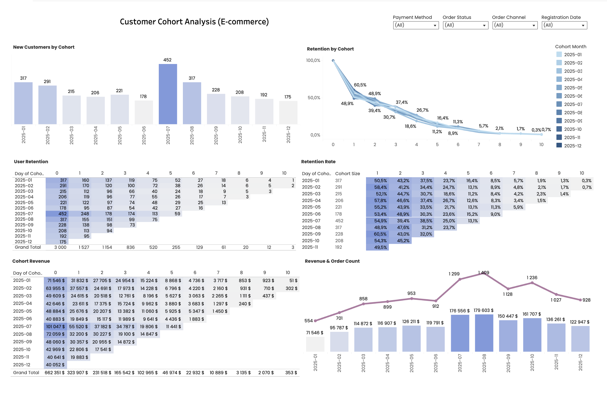

# Customer Cohort Analysis

Tableau project focused on customer cohort analysis, retention patterns, revenue performance, and customer behavior in e-commerce.

## Project Overview

This learning project demonstrates how Tableau can be used to analyze customer cohorts, measure retention over time, compare cohort performance, and explore revenue trends through an interactive dashboard.

The dashboard combines cohort size, retention, cohort revenue, and monthly revenue performance in one analytical view.

## Business Goal

The goal of this project was to:

- Analyze how many new customers joined in each cohort
- Measure customer retention over subsequent periods
- Compare retention performance between cohorts
- Analyze revenue generated by each cohort
- Compare monthly revenue and order volume
- Identify stronger and weaker customer acquisition periods

## Tools & Skills

- Tableau
- Cohort analysis
- Retention analysis
- Customer segmentation
- Revenue analysis
- Interactive filters
- Heatmaps
- Data visualization
- Dashboard design
- Business analysis

## Dashboard Overview

The dashboard contains several analytical sections:

### New Customers by Cohort

Shows the number of new customers acquired in each monthly cohort.

The largest cohort was **July 2025 with 452 new customers**.

### Retention by Cohort

Visualizes how customer retention changes over time for each monthly cohort.

The dashboard makes it possible to compare how quickly customers from different acquisition periods stop returning.

### User Retention

Shows the absolute number of retained customers for each cohort and subsequent period.

### Retention Rate

Displays retention percentages in a cohort heatmap, allowing strong and weak retention periods to be identified quickly.

### Cohort Revenue

Shows how much revenue each cohort generated during its lifecycle.

### Revenue & Order Count

Compares monthly revenue with the number of orders, making it possible to analyze whether revenue trends follow transaction volume.

## Interactive Filters

The dashboard includes filters for:

- Payment Method
- Order Status
- Order Channel
- Registration Date

These filters allow the analysis to be adjusted for different customer and transaction segments.

## What I Did

- Structured customer data into monthly cohorts
- Calculated cohort sizes
- Analyzed customer retention across subsequent periods
- Built retention tables and heatmaps
- Analyzed revenue by cohort
- Compared monthly revenue and order volume
- Created interactive filters for deeper analysis
- Combined multiple analytical views into a single Tableau dashboard
- Designed visualizations for quick comparison of cohort performance

## Key Insights

- The dataset contains **3,000 customers** across the analyzed cohorts.
- **July 2025** had the largest acquisition cohort with **452 new customers**.
- **December 2025** had the smallest cohort with **175 new customers**.
- First-period retention varied significantly between cohorts.
- The **September 2025 cohort** showed the highest first-period retention rate at **60.5%**.
- Retention gradually decreased across subsequent periods for all cohorts.
- Revenue increased strongly during the second half of the year.
- The highest monthly revenue shown on the dashboard was approximately **$179,603 in August 2025**.
- August also had the highest order volume shown in the dashboard, with **1,409 orders**.
- Cohort size alone did not determine long-term retention or revenue performance, showing the importance of analyzing customer quality together with acquisition volume.

## Live Dashboard

[Open the interactive dashboard in Tableau Public](https://public.tableau.com/views/CustomerCohortAnalysisE-commerce_17814429667150/CohortAnalysis?:language=en-GB&:sid=&:redirect=auth&:display_count=n&:origin=viz_share_link)

## Dashboard Preview

