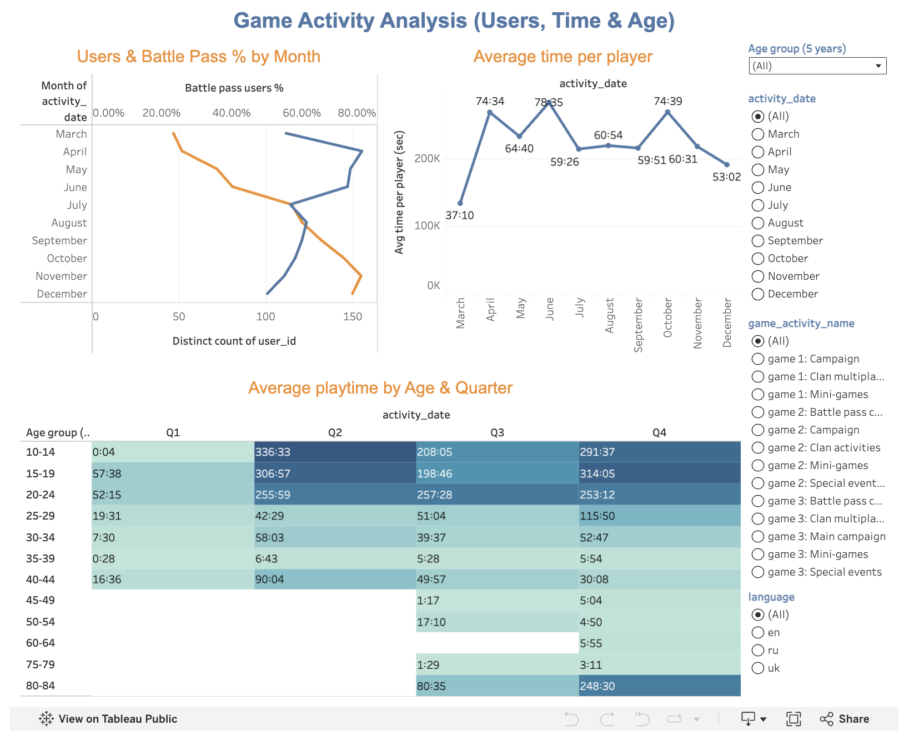

# Game Activity Dashboard

Tableau project focused on analyzing game activity, user engagement, playtime patterns, age groups, and Battle Pass adoption.

## Project Overview

This learning project demonstrates how Tableau can be used to analyze player activity and engagement across different months, age groups, quarters, and game activity types.

The dashboard combines user counts, Battle Pass adoption, average playtime, and age-based activity patterns in one interactive analytical view.

## Business Goal

The goal of this project was to:

- Analyze monthly user activity
- Track the share of Battle Pass users
- Compare average playtime across months
- Analyze playtime across different age groups
- Compare activity patterns by quarter
- Explore player behavior using interactive filters

## Tools & Skills

- Tableau
- User activity analysis
- Engagement analysis
- Age segmentation
- Time-based analysis
- Heatmaps
- Interactive filters
- Data visualization
- Dashboard design
- Business analysis

## Dashboard Overview

### Users & Battle Pass % by Month

Shows the number of active users by month together with the share of Battle Pass users.

This view helps compare overall user activity with Battle Pass adoption over time.

### Average Time per Player

Shows how average playtime changed across months.

This chart makes it possible to identify periods with higher and lower player engagement.

### Average Playtime by Age & Quarter

Uses a heatmap to compare average playtime across age groups and quarters.

This helps identify which age segments were more active during different periods.

## Interactive Filters

The dashboard includes filters for:

- Age group
- Activity date
- Game activity
- Language

These filters allow the analysis to be adjusted for different player segments and activity types.

## What I Did

- Analyzed monthly game activity
- Compared user counts and Battle Pass adoption
- Calculated and visualized average playtime
- Segmented players by age group
- Compared activity across quarters
- Built a heatmap for age-based playtime analysis
- Added interactive filters for deeper exploration
- Combined several analytical views into one Tableau dashboard

## Key Insights

- User activity varied noticeably across the analyzed months.
- July showed the highest number of users in the period displayed.
- Average playtime reached its highest levels in June and October.
- Younger age groups generally showed higher playtime than older groups.
- Q2 and Q4 contained several of the strongest playtime values across the main age segments.
- Battle Pass adoption increased during the later months shown in the dashboard.

## Live Dashboard

[Open the interactive dashboard in Tableau Public](https://public.tableau.com/views/_3_17600338024370/GameActivityDashboard?:language=en-GB&:sid=&:redirect=auth&:display_count=n&:origin=viz_share_link)

## Dashboard Preview

